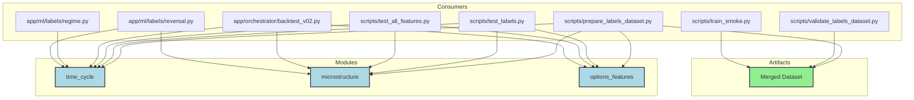

# Feature Module Dependency Graph

```mermaid
graph TD
    subgraph Modules
        TC[time_cycle]
        MS[microstructure]
        OPT[options_features]
    end

    subgraph Artifacts
        MD[Merged Dataset]
    end

    subgraph Consumers
        PREP[scripts/prepare_labels_dataset.py]
        TL[scripts/test_labels.py]
        TAF[scripts/test_all_features.py]
        BT[app/orchestrator/backtest_v02.py]
        REG[app/ml/labels/regime.py]
        REV[app/ml/labels/reversal.py]
        VAL[scripts/validate_labels_dataset.py]
        SMOKE[scripts/train_smoke.py]
    end

    PREP --> TC
    PREP --> MS
    PREP --> OPT
    PREP --> MD

    TL --> TC
    TL --> MS
    TL --> OPT

    TAF --> TC
    TAF --> MS
    TAF --> OPT

    BT --> TC
    BT --> MS
    BT --> OPT

    REG --> TC
    REV --> TC
    REV --> MS

    VAL --> MD
    SMOKE --> MD

    style TC fill:#add8e6,stroke:#333,stroke-width:2px
    style MS fill:#add8e6,stroke:#333,stroke-width:2px
    style OPT fill:#add8e6,stroke:#333,stroke-width:2px
    style MD fill:#90ee90,stroke:#333,stroke-width:2px
```
