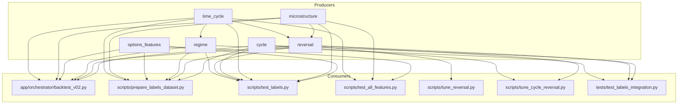

# Feature & Label Dependency Graph

```mermaid
graph TD
    %% Nodes
    subgraph Producers
        TC[time_cycle]
        MS[microstructure]
        OPT[options_features]
        REG[regime]
        REV[reversal]
        CYC[cycle]
    end

    subgraph Consumers
        BT[app/orchestrator/backtest_v02.py]
        PLD[scripts/prepare_labels_dataset.py]
        TL[scripts/test_labels.py]
        TAF[scripts/test_all_features.py]
        TR[scripts/tune_reversal.py]
        TCR[scripts/tune_cycle_reversal.py]
        TLI[tests/test_labels_integration.py]
    end

    %% Edges
    TC --> BT
    MS --> BT
    OPT --> BT
    REG --> BT
    REV --> BT
    CYC --> BT

    TC --> PLD
    MS --> PLD
    OPT --> PLD
    REG --> PLD
    REV --> PLD
    CYC --> PLD

    REG --> TL
    REV --> TL
    CYC --> TL
    TC --> TL
    MS --> TL
    OPT --> TL

    TC --> TAF
    MS --> TAF
    OPT --> TAF

    REV --> TR

    CYC --> TCR
    REV --> TCR

    REG --> TLI
    REV --> TLI
    CYC --> TLI

    %% Inter-module
    TC --> REG
    TC --> REV
    MS --> REV
```
